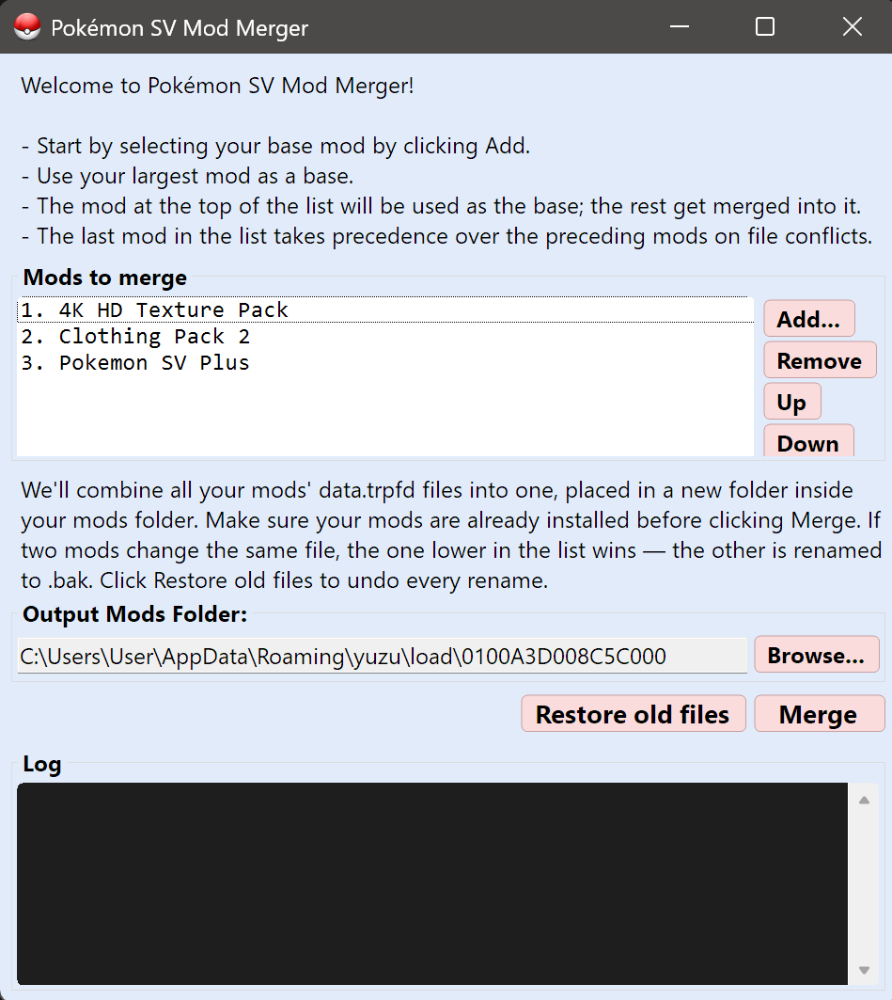

# Pokémon SV Mod Merger

<p align="center">
  
</p>

A small Windows tool that merges multiple Pokémon Scarlet/Violet mod
`data.trpfd` files into one, so mods that each ship their own TRPFD can
coexist without clobbering each other.

## The problem

Emulators only load one `data.trpfd` per game — whichever mod folder
wins the load order. If you install three mods that each ship a modified
TRPFD (e.g. a texture pack, a clothing pack, and a gameplay overhaul), two
of them silently get ignored and most of their files don't load.

Existing tools didn't solve this for SV:

- **Trinity Mod Loader** doesn't merge TRPFDs — it just stacks files and
  lets the last one win on conflicts.
- **TrpfdUpdater (Aqua-0)** has a directory whitelist hardcoded for
  Pokémon Legends: Arceus, so it silently filters out all Scarlet/Violet
  directories and produces an output identical to the base input.

## What this does

Reads each mod's `data.trpfd`, unions all the "unused" hash sets (the
manifest of files each mod overrides), and writes a single merged
`data.trpfd` to a new mod folder (`AAA_Master` by default). It also
renames each source mod's `data.trpfd` to `data.trpfd.bak` so the
emulator only sees one TRPFD and the right one loads.

**Loose-file conflict resolution** — beyond merging TRPFDs, the tool
also scans every mod's `romfs/` folder during the merge. If two mods
ship a file at the same relative path (e.g. both retexture the same
outfit), the one lower in your list wins; the higher-up mod's copy is
renamed to `.bak`. This means your list order genuinely determines who
wins on conflicts, instead of leaving it to the emulator's alphabetical
mod-folder load order.

A **Restore old files** button reverses every `.bak` rename in one
click — both the TRPFD backups and the loose-file backups.

## Usage (GUI)

1. Download the latest `PKSVModMerger.exe` from the [Releases page](../../releases).
2. Double-click to launch.
3. Click **Add...** for each mod folder you want to include. The mod at
   the top of the list is treated as the base; the rest are merged into
   it. **The last mod in the list wins on file conflicts** — put your
   highest-priority mods at the bottom. The largest mod is usually the
   best base (position 1).
4. Click **Browse...** for the Output Mods Folder — pick your mods
   folder (the one that holds each mod's subfolder).
5. Click **Merge**. Watch the log for `[conflict]` lines if any loose
   files overlap between mods — the lower-priority copies get renamed
   to `.bak` automatically.
6. Enable the new `AAA_Master` folder in your mod manager, and disable
   the original mods' TRPFDs (or leave them — their `.trpfd` files are
   already renamed to `.bak` so they won't conflict).

To revert everything: click **Restore old files**. Then either disable
`AAA_Master` in your mod manager or delete the folder.

## Usage (CLI)

```
PKSVModMerger.exe <output.trpfd> <base.trpfd> <add1.trpfd> [<add2.trpfd> ...]
```

Reads `<base>` as the starting TRPFD and unions every `<addN>`'s unused-hash
set into it. The result is written to `<output.trpfd>` and prints a summary.

## Building from source

Requires .NET 8 SDK on Windows.

```
git clone https://github.com/Dspivey21/PKSVModMerger.git
cd PKSVModMerger
dotnet build -c Release
```

The exe lands at `bin\Release\net8.0-windows\PKSVModMerger.exe`.

### Regenerating the schema (optional)

The C# files under `Generated/` are produced from `data.trpfd.fbs` by
Google's `flatc` compiler. They're checked-in so you don't need `flatc`
to build. If you change the `.fbs` schema, regenerate them with:

```
.\tools\flatc.exe --csharp -o Generated data.trpfd.fbs
```

You'll need to download `flatc.exe` yourself from the
[FlatBuffers releases](https://github.com/google/flatbuffers/releases)
(`Windows.flatc.binary.zip`) and drop it in `tools/`.

## How the merge works

`data.trpfd` is a FlatBuffer file with these fields:

- `FileHashes` — FNV-1a-64 of every romfs-relative path the game serves
  from indexed packs
- `UnusedHashes` — hashes the game treats as "skip my pack, look on disk
  instead" (i.e. modded files)
- Parallel `FileInfo` arrays giving each hash a pack index

A modded TRPFD moves certain hashes from `FileHashes` into `UnusedHashes`,
which tells the game to skip the indexed pack and look for the file on
disk. Merging is just unioning all the `UnusedHashes` sets together — for
each unused hash any input declares, the merged TRPFD also marks it unused.

For loose-file conflicts (two mods both shipping a real file at the same
path), the tool walks the mod list in reverse and assigns each relative
path to the latest mod that has it. Earlier mods' copies of the same
path are renamed to `.bak`. The relevant scope is each mod's `romfs/`
folder — files outside `romfs/` (READMEs, mod metadata) are ignored,
and `romfs/arc/data.trpfd` is excluded because it's handled separately
by the TRPFD merge itself.

## Credits

- [Aqua-0/TrpfdUpdater](https://github.com/Aqua-0/TrpfdUpdater) for
  publicly documenting the TRPFD format. This project's `data.trpfd.fbs`
  schema describes the same on-disk layout TrpfdUpdater documents, but the
  C# accessors are independently generated by Google's `flatc` from our
  own `.fbs` file — no code from TrpfdUpdater ships in this repo.
- [pkZukan/gftool](https://github.com/pkZukan/gftool) for the broader
  TRPFS/TRPFD virtual file system documentation.

See [THIRD-PARTY-NOTICES.md](THIRD-PARTY-NOTICES.md) for license details.

## License

[MIT](LICENSE).
